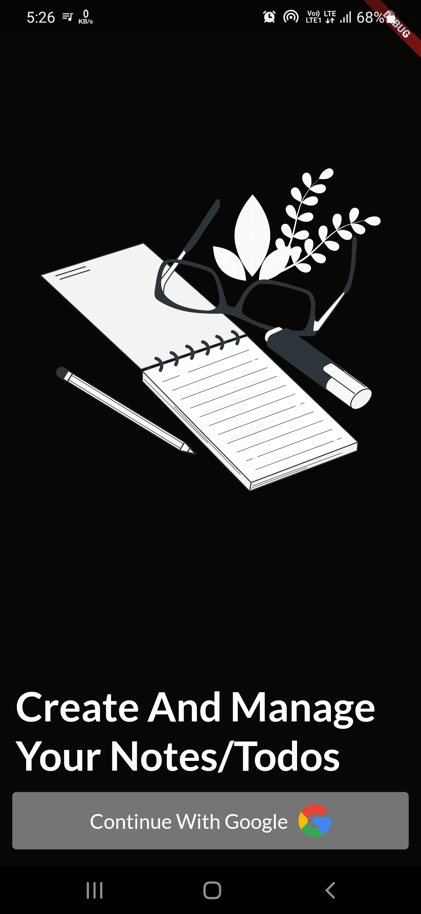
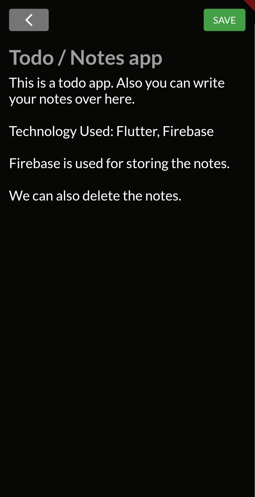
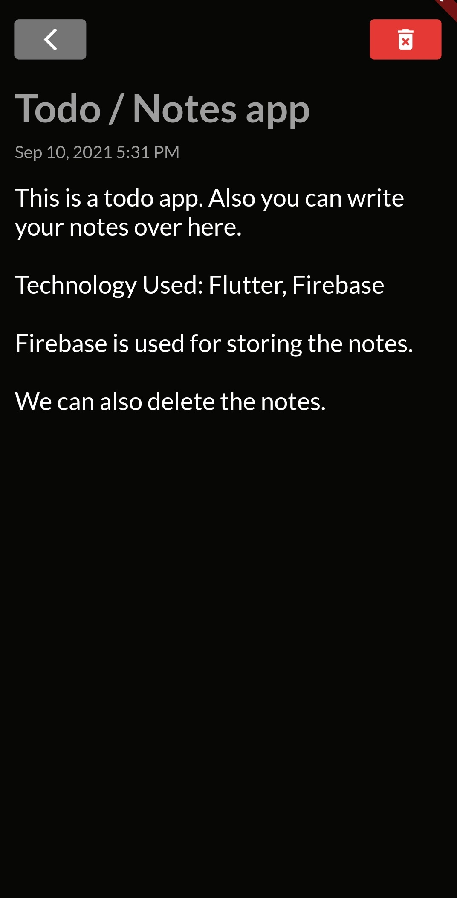

# ToDo / Notes App

This is a Todo mobile application in which users can write there notes or tasks which they have to ToDo.

First the user has to login in the app. Then only he can create his notes.

Firebase is used to store the notes of the users int he database. We can also delete the notes in this app.

## Tech Stack

Flutter + Firebase

## Screenshots of the App

