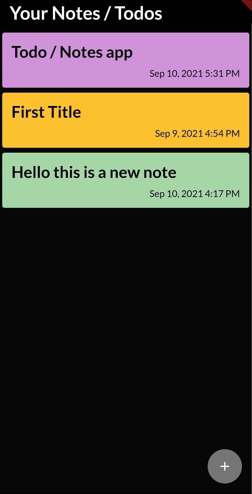

# ToDo / Notes App

This is a Todo mobile application in which users can write their notes or tasks which they have to ToDo.

First, the user has to login into the app. Then only he can create his notes.

Firebase is used to store the notes of the user in the database. We can also delete the notes in this app.

## Tech Stack

Flutter + Firebase

## Screenshots of the App

- **Front**    
 

- **Main Screen**    
 

- **Creating a note screen**    
 

- **Write and then save**    
 

- **Later on view your notes**    
 

